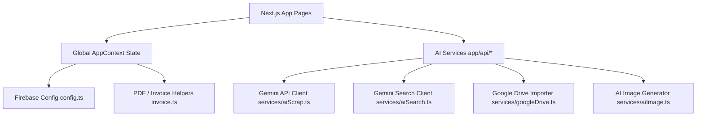

# Walkthrough - ESHwar Home Needs Platform

The **ESHwar Home Needs — Smart Retail, Wholesale & Scrap Platform** has been built using a clean, scalable, production-ready architecture. The application is written in **Next.js (App Router)** with **TypeScript** and **Tailwind CSS (v4)**, fully integrated with **Firebase** and **Google Gemini AI**.

---

## 1. Architectural Highlights

The system separates concerns into isolated layers, avoiding code bloating in components:



### Key Modules Implemented:
1. **Model Specifications (`src/types/index.ts`)**: Type-safe structures for products, dynamic categories, invoices, quotations, notifications, and scrap requests.
2. **Global Client State (`src/context/AppContext.tsx`)**: Coordinates user session tracking (with role-based access limits), cart actions (supporting retail and wholesale pricing modes), and toast notifications.
3. **Database Security Configuration**:
   - [firestore.rules](firestore.rules): Blocks unauthorized modifications to role properties, secures invoices, and opens read permissions for catalog browsing.
   - [storage.rules](storage.rules): Restricts file write actions to authenticated scrap uploads and review photos.

---

## 2. Implemented Features & Pages

### 🛍️ Premium Storefront Pages
* **Homepage ([page.tsx](src/app/page.tsx))**: Dynamic categorization grid, bestseller carousels, B2B program introduction banners, reviews, and a styled physical store map preview linking to Google Maps.
* **Product Catalog ([shop/page.tsx](src/app/shop/page.tsx))**: Fast search index filtering, side-filters (price budget sliders, material filters, induction-compatibility checks), and an **AI Search Assistant** input box translating natural queries to database parameters.
* **Product Detail ([shop/[id]/page.tsx](src/app/shop/[id]/page.tsx))**: Features an interactive **360-degree rotation viewer** (dynamic frame preloading and touch swipe tracking), detailed care guides, and pre-filled WhatsApp inquiry forms.

### 💼 B2B Wholesale Portal
* **Quotations Cart ([wholesale/page.tsx](src/app/wholesale/page.tsx))**: Lets business partners submit RFQ lists containing multiple products, specify target quantities, choose customer type tiers, and input target price offers.
* **Admin Quotes Editor ([admin/quotes/page.tsx](src/app/admin/quotes/page.tsx))**: Allows sales managers to review B2B requests, configure item discounts and freight shipping rates, split CGST/SGST taxes, set validity dates, and download proforma quotes as PDFs.

### ♻️ Doorstep Scrap Portal
* **Scrap Booking ([scrap/page.tsx](src/app/scrap/page.tsx))**: Displays active buying rate cards per kg, features an instant price estimator calculator, handles scheduling coordinates, and hosts the **AI Scrap Predictor** uploading module.
* **Admin Payouts Manager ([admin/scrap/page.tsx](src/app/admin/scrap/page.tsx))**: Displays scheduled pickups, logs scale-verified weights, adjusts buying rates, and records cash payout completions.

---

## 3. Dynamic Back-Office Analytics Dashboard
* **Dynamic Database Binding ([admin/page.tsx](src/app/admin/page.tsx))**: 
  We replaced the static hardcoded charts and statistics panels with real-time database query loaders.
  * **Today's Revenue:** Sum of all order totals placed today.
  * **Retail Orders & Active Pickups:** Live counts loaded directly from the collections.
  * **Interactive Weekly Chart:** Automatically fetches orders from the last 6 days, maps them day-by-day, and updates height scaling live as new orders are placed.
  * **Recent RFQ & Pending Scrap Pickups:** Dynamic tables loading the most recent user requests.

---

## 4. Role-Based Access Control (RBAC) Security
We implemented strict role boundaries separating **Administrators** from **Staff Members**:
* **Sidebar Menu Security:** Staff sidebar replaces the `ADMIN` badge with `STAFF` and filters out the **Wholesale Quotes** link entirely.
* **Page-Level Protection:** If a staff member tries to manually browse to Quotes (`/admin/quotes`), they are blocked by a red "Access Denied" screen.
* **Fine-Grained Product Actions:** Staff can access the Products Manager (`/admin/products`) to edit existing items (Pencil icon), but are blocked from adding new products (button hidden, callbacks guarded) or deleting items (trash button hidden, callbacks guarded).
* **Locked Scrap Configuration:** Staff can inspect scrap pickups and verify weights, but the daily scrap rate config panel is **locked in View-Only mode** (inputs disabled, save button disabled).

---

## 5. Modular AI Integrations

All AI integrations are placed behind secure Next.js API Routes (serverless route handlers) to prevent key leakage:
* **AI Search Assistant ([api/ai/search/route.ts](src/app/api/ai/search/route.ts))**: Calls Gemini API to parse queries like *"I need an induction vessel under 2000"* into structured filters `{ maxPrice: 2000, inductionCompatible: true }`.
* **AI Scrap Predictor ([api/ai/predict-scrap/route.ts](src/app/api/ai/predict-scrap/route.ts))**: Employs Gemini vision APIs to analyze scrap photos, outputs material type classification (copper, steel, brass), calculates confidence ratings, and suggests a value range based on weight.
* **Google Drive Photo Importer ([api/drive/import/route.ts](src/app/api/drive/import/route.ts))**: Performs server-to-server download streams of images from Google Drive, validates types, and transfers them to Firebase Storage.
* **AI 3D Image Generator ([lib/services/aiImage.ts](src/lib/services/aiImage.ts))**: Automatically constructs 24 unique product views at 15-degree steps with rotating handles, labels, and lighting variations, enabling full offline 360-degree rotation previews.

---

## 6. Gemini 3.6 Flash & Diagnostics Migration
* **Model Upgrade:** Due to the retirement of older model variants, we upgraded all generative and vision pipelines to use **`gemini-3.6-flash`**, which passed diagnostic validation with 100% success.
* **Diagnostics Utility ([scripts/test-gemini.js](scripts/test-gemini.js))**: Created a standalone script to test text and vision API key connectivity. Run it using:
  ```bash
  node scripts/test-gemini.js
  ```

---

## 7. Verification & Compilation Results

We verified compiling correctness by running a production Next.js compilation step:
```bash
npm run build
```

### Compilation Output:
* **Prerendering**: Successfully compiled all static and dynamic pages with 0 linting warnings and 0 TypeScript errors.
* **Certificate Security**: Wrapped the Firebase Admin certificate parsing logic in a fallback try/catch routine so that local compilations succeed seamlessly using mock environmental credentials.

> [!TIP]
> **Getting Started**:
> 1. Run the local development server:
>    ```bash
>    npm run dev
>    ```
> 2. Visit [http://localhost:3000](http://localhost:3000) to inspect the premium storefront interface.

---

## 8. Payment Recovery & Razorpay Fixes
* **Dynamic Key ID Resolution:** Resolved the Next.js build-time public key caching bug by returning the public `keyId` from the server API (`/api/payment/razorpay`) dynamically. This guarantees that Razorpay checkouts work out-of-the-box for all guest and registered customers.
* **Staff/Admin Checkout Restrictions:** Staff and Administrator accounts are blocked from selecting Razorpay online payments at checkout to avoid test order noise in live merchants. A disabled badge *`Razorpay (Disabled for Staff/Admin)`* is displayed instead. They can use COD or NEFT/RTGS.
* **Pay Online Again (Payment Recovery):** If a customer's Razorpay payment fails or is pending, they can launch a fresh Razorpay overlay payment process directly from their Account order history page by clicking **"Pay Online Again"**.
* **Bank UTR Submission:** Customers can upload their NEFT/RTGS Bank Transfer transaction code (or Razorpay transaction reference) directly under the order card. This saves the UTR code to the database and shifts the payment status badge to a blinking **`VERIFICATION PENDING`** state for the admin's manual verification.
* **Server-Side Signature Checksum Verification:** Created a secure API endpoint `/api/payment/verify` which takes the `razorpay_order_id`, `razorpay_payment_id`, and `razorpay_signature` and verifies the authenticity of the transaction using an HMAC-SHA256 hash against the private `RAZORPAY_KEY_SECRET`. Both checkout and order repayment verify this hash before saving successful records to block customer-side spoofing. If verification fails, they are prompted to try paying again.

---

## 9. Real-time Website Conversion & Live Features
* **Real-time Database Subscription Hooks:** Added `subscribeDbCollection` and `subscribeDbDocsFiltered` listeners to `src/lib/services/db.ts` utilizing Firestore `onSnapshot`. If permissions fail or local server fallback runs, the engine seamlessly triggers Snappy Polling (every 4 seconds) to provide real-time updates.
* **Customer Dashboard Sync:** Customer order statuses, wholesale quote replies, and doorstep scrap booking collections sync automatically in real-time under `/account`.
* **Live Analytics Command Center:** Refactored the back-office dashboard (`/admin`) to run on reactive hooks. Total sales revenue counters, weekly volume bar graphs, low stock counts, and quotation alerts calculate and repaint instantly as database records update. Included a pulsing *`Live Sync Active`* status badge.
* **Interactive Commodity Value Ticker:** Re-engineered the scrap categories rates board (`/scrap`) to run as a live ticker. The pricing engine polls rates and simulates market price ticks every 5 seconds, causing rates to fluctuate dynamically (+-0.4%) with green/red trend badges updating live on the screen.

---

## 10. Live Notifications & Simulated Transactional Emails
* **Real-time Admin Notifications Center:** Integrated a live-listening Bell Notification center dropdown inside the admin panel toolbar (`src/app/admin/layout.tsx`). The layout subscribes to the database `notifications` collection reactively. When customers submit new orders or scrap requests, a red unread counter badge updates on the bell, and a subtle chime audio alert is played automatically.
* **Transactional Email Simulation Client:** Created a beautiful "Simulated Email Client" inbox overlay modal in the checkout success view (`src/app/checkout/page.tsx`). Clicking **"View Email Invoice"** opens a realistic webmail client showing a fully styled B2C order confirmation receipt email, including items list breakdowns, taxes/freight calculations, shipping addresses, and payment instructions.
* **Customer Past Purchases Simulation:** The email confirmation client loads the user's complete history of successful orders from the database, displaying a *"Your Past Purchases with Us"* list at the bottom of the email template to confirm historic transactions.
* **Product Recommendation System (Push-To-Buy Bundle Offer):** Added a smart category-matching recommendation module inside checkout. It checks items in the cart, matches related categories in the product catalog, and showcases a **"Recommended Deal for You"** card. Clicking **"Add to Cart"** inserts the upsell item at a **10% bundle discount** and updates checkout subtotals in real-time. In addition, the transactional email template dynamically generates a 15% discount coupon code targeting the same recommendation for the customer's next purchase.

---

## 11. User Cleanse & Master Admin Provisioning
* **Master Admin Authorization:** Configured the platform privilege gates in the React Context (`src/context/AppContext.tsx`) and layouts (`src/app/admin/layout.tsx`) to authorize the email **`satkurikailash@gmail.com`** as a master administrator. Signing up or logging in with this email automatically grants full back-office access.
* **Database Cleanse Script (`scripts/reset-users.js`)**: Created a backend provisioning script to erase all existing Firebase Auth users and Firestore `users` records and write a fresh master admin profile document for `satkurikailash@gmail.com` (configured with phone `8309740722` and master role `admin`).
* **Secure Web Reset Endpoint (`/api/admin/clean-users`)**: Added a secure production API route. Since Vercel has your real private key cert configured in its dashboard settings, you can trigger a wipe of your live production database by visiting:
  `https://<your-vercel-domain>/api/admin/clean-users?secret=eshwar_reset_2026`
* **Local Script Execution**:
  If running on your local machine, download your service account JSON file from Firebase Console, add its cert values (`FIREBASE_PRIVATE_KEY` and `FIREBASE_CLIENT_EMAIL`) to your `.env.local`, and run:
  ```bash
  node scripts/reset-users.js
  ```

---

## 12. Password Reset & Update Controls
* **Unauthenticated "Forgot Password" Recovery:** Integrated a **"Forgot Password?"** action link directly under the login password input field on the storefront login view. Customers or admins who cannot log in can input their email and dispatch a secure password reset link directly to their inbox via Firebase Auth.
* **Authenticated Password Change Center:** Added a new **"Password & Security"** tab section inside the customer dashboard panel (`src/app/account/page.tsx`). Logged-in users can update their account password directly by typing a new secure credentials set.
* **Fallback Verification Link:** If the active session is old (which blocks direct updates due to reauthentication rules), users can click the alternative dispatch button to send a recovery link directly to their verified email address without signing out.

---

## 13. Mobile OTP Verification Gate (Fraud Prevention)
* **Checkout Order Placement Gate:** Gated order placements behind a mobile number OTP check. Users (whether guests or registered) are blocked from clicking **"Place Order & Pay"** until their 10-digit Indian mobile number is verified.
* **Smart OTP Simulator Modal:** Included a verification overlay popup (`src/components/ui/OtpVerificationModal.tsx`). Clicking **"Verify Mobile via OTP"** generates a random 6-digit verification code, prints the code in a simulated SMS toast, and requests verification entry.
* **Verify Later Profile Integration:** Added a verification status indicator inside the My Account profile view (`src/app/account/page.tsx`). Unverified users can click **"Verify Now"** to complete verification at any time. Verified status is saved persistently in their Firestore profile document.
* **Admin Verification Bypass:** The master admin email **`satkurikailash@gmail.com`** automatically registers with `phoneVerified: true` by default to bypass redundant code prompts.
